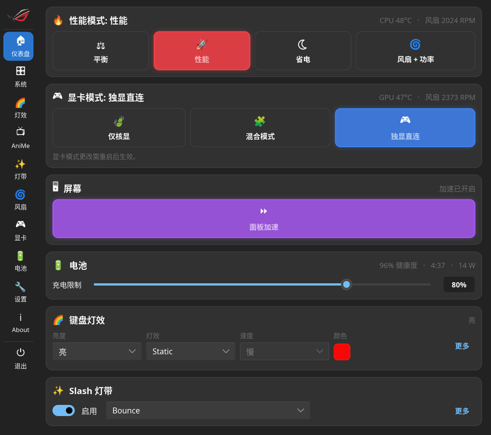

# 这是一个基于上游asusctl的UI重制版
# asusctl for ASUS ROG

<p align="center">
  <a href="https://www.patreon.com/bePatron?u=7602281"></a>
  <a href="https://ko-fi.com/V7V5CLU67"></a>
  <a href="https://asus-linux.org/"></a>
  <a href="https://discord.gg/B8GftRW2Hd"></a>
</p>

`asusctl` is a system control utility for Linux designed primarily for ASUS ROG, TUF and ProArt laptops, with reduced functionality available for non-ASUS hardware.

> [!WARNING]
> **Kernel requirement:** many features are developed alongside Linux kernel updates. If an expected feature is missing, make sure you are running the latest stable kernel, or a kernel containing the required patches. TDP control in particular requires the `asus-armoury` driver, mainline since Linux 6.19.



## Components

| Component | Description |
| :--- | :--- |
| `asusd` | System daemon exposing hardware control over D-Bus |
| `rog-control-center` | Graphical interface (dashboard, fan curves, Aura, GPU modes, …) with tray integration |
| `asusctl` | Command-line client for `asusd` |
| `asusd-user` | Per-user daemon for AniMe Matrix and related user services |
| `asus-shutdown` | Shutdown helper that safely applies deferred GPU firmware settings |

## The control center UI

`rog-control-center` presents a single, consistent dark card-based interface:

- **Dashboard** — one page for the everyday controls: performance profile, GPU mode, display toggles, battery charge limit, keyboard lighting and Slash lighting, each with live status.
- **System** — hardware monitor plus platform profile, EPP and PPT (CPU/GPU power limit) tuning.
- **Aura** — keyboard lighting modes with per-colour HSV pickers and per-zone power behaviour.
- **AniMe Matrix** — brightness, display and built-in animation settings for equipped models.
- **Slash** — A-cover LED strip brightness, animation and visibility triggers.
- **Fans** — per-profile, per-fan custom fan curves on an interactive graph.
- **GPU** — Integrated/Hybrid/Ultimate switching, reserved GPU memory, XG Mobile LED.
- **Battery** — charge limit and battery health information.
- **Settings** — tray, autostart, notifications and the ROG/Armoury key global shortcut.

The whole interface is built from a shared design system: all colours, spacing, corner radii and font sizes come from the `Theme` global in
[`rog-control-center/ui/widgets/theme.slint`](rog-control-center/ui/widgets/theme.slint), and pages are composed from common widgets (cards, section headers, info banners, slider/toggle/dropdown rows) in `rog-control-center/ui/widgets/`. If you want to adjust the look of the app, start there — no page-local colour hex values are used.


### Display server support

> [!NOTE]
> X11 is officially unsupported. Users who require it may compile the GUI with X11 support enabled using `cargo build --features "rog-control-center/x11"`. Operation on unmaintained display servers remains the responsibility of the user.

## Implemented features

Feature availability depends on upstream kernel support and hardware capabilities.

- **Power and performance:** platform profiles with per-profile EPP and AC/battery policy switching, custom fan curves, PPT/CPU/GPU power-limit sliders, GPU MUX toggling (2022+ models)
- **Lighting:** built-in LED modes, per-key RGB, AniMe Matrix displays (G14, M16, Strix Scar 16/18), Slash lighting
- **System:** battery charge limits and health reporting, POST audio toggle, dGPU power notifications, global shortcuts through the desktop portal

Keyboard backlight support relies on the hardware mappings in [`rog-aura/data/aura_support.ron`](rog-aura/data/aura_support.ron) (installed to `/usr/share/asusd/aura_support.ron`). See the [rog-aura README](rog-aura/README.md) for details.

### Service management

`asusctl` uses `udev` rules to start its services when hardware is detected. On distributions such as Fedora or Ultramarine, enable the services manually after installation:

```sh
sudo systemctl enable --now asusd.service
sudo systemctl enable --now asus-shutdown.service
```

On Pop!_OS, disable the `system76-power` GNOME extension and its service to avoid power-profile conflicts.

Full per-distribution guides, including immutable Fedora variants, Bazzite, NixOS and PikaOS, live in the [documentation book](https://asus-linux.org/) (`docs/` in this repository).

### Building from source

A Rust toolchain from [rustup.rs](https://rustup.rs/) (stable) is required, plus the usual build tools.

#### Arch Linux

```sh
sudo pacman -S git cmake clang pkg-config libzip rust openssl
make
sudo make install
```

Then remove any leftover configuration in `/etc/asusd/`. For package installations, use your distribution's package manager instead.

## Development

The repository is a Cargo workspace. Daemon-side architecture patterns are documented in [docs/dev/design-patterns.md](docs/dev/design-patterns.md), user and distribution documentation in `docs/` (an mdBook), and the CLI reference in [MANUAL.md](MANUAL.md).

### Running the UI without hardware

`rog-control-center` has a demo mode that runs the full interface with representative fake data — no `asusd`, no dbus, no ASUS hardware required. It is the fastest way to work on the UI:

```sh
cargo build -p rog-control-center
./target/debug/rog-control-center --demo

# Open directly on a specific page (0 = dashboard … 9 = about)
ROGCC_DEMO_PAGE=1 ./target/debug/rog-control-center --demo
```

All controls are interactive and update only the demo state.

### AniMe Matrix simulator

An SDL2-based simulator is included for testing matrix rendering without hardware:

```sh
cargo build --package rog_simulators
./target/debug/anime_sim
```

Restart `asusd` after starting the simulator to attach it to the simulated display.

### Tests and linting

```sh
cargo test
cargo clippy
```

Please read [CONTRIBUTING.md](CONTRIBUTING.md) before opening pull requests.


## License

This project is licensed under the [Mozilla Public License 2.0 (MPL-2.0)](LICENSE).

---

ASUS and ROG are registered trademarks of ASUSTeK Computer Inc. in the United States and other jurisdictions. References to ASUS products, services, or trademarks within this repository do not constitute or imply endorsement, sponsorship, or recommendation by ASUSTeK Computer Inc. Trademarks are used solely for hardware identification purposes.

---

## AI Disclaimer

We do not accept code blindly written with just AI or "vibecoding". We encourage use of AI for finding bugs and as a tool used to assist development, but all of these must be verified by a human as AI makes mistakes and gives false bug reports as well. For further details, refer to [our contribution policy](./CONTRIBUTING.md)
