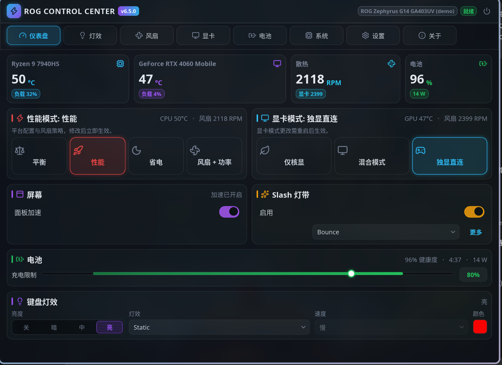
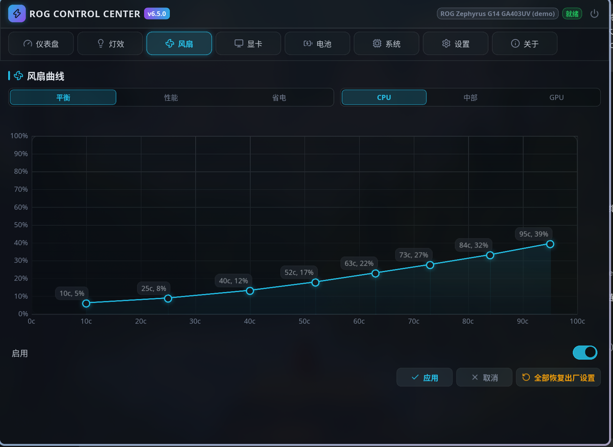
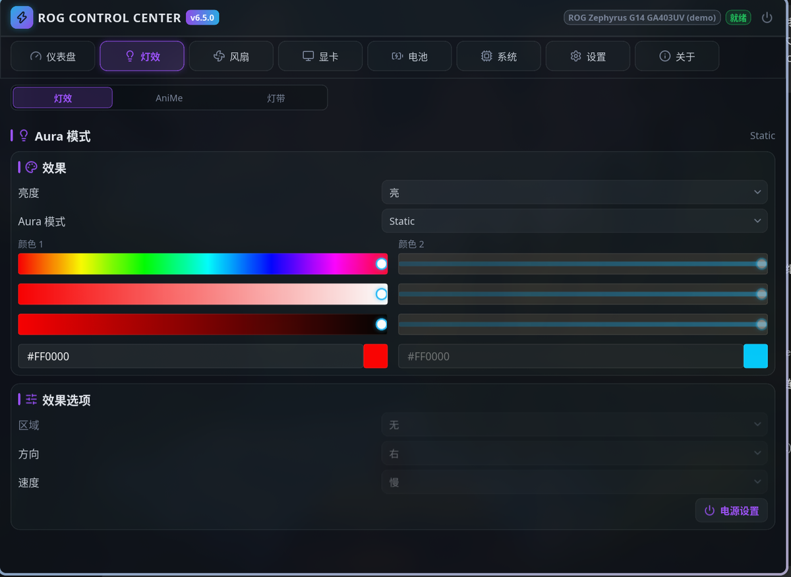

# asusctl for ASUS ROG

[English](README.md) | **简体中文**

> **关于本仓库** —— 这是 [上游 asusctl](https://github.com/OpenGamingCollective/asusctl) 的 **UI 重制版**。
> `rog-control-center` 已按暗黑卡片化的「cyber」风格重新设计：顶部标签栏导航、全自绘控件、Lucide 线性图标。
> 守护进程（`asusd`）、命令行（`asusctl`）与各支撑库均跟随上游；**D-Bus 接口未做改动**，因此两侧可以独立更新。

<p align="center">
  <a href="https://www.patreon.com/bePatron?u=7602281"></a>
  <a href="https://ko-fi.com/V7V5CLU67"></a>
  <a href="https://asus-linux.org/"></a>
  <a href="https://discord.gg/B8GftRW2Hd"></a>
</p>

`asusctl` 是面向 Linux 的系统控制工具，主要支持华硕 ROG、TUF 与 ProArt 笔记本；非华硕硬件也能使用部分功能。

> [!WARNING]
> **内核要求：** 许多功能与 Linux 内核更新同步开发。如果缺少某个预期功能，请确认正在使用最新的稳定版内核，或包含相应补丁的内核。其中 TDP 控制依赖 `asus-armoury` 驱动（自 Linux 6.19 起进入主线）。



## 组件构成

| 组件 | 说明 |
| :--- | :--- |
| `asusd` | 系统守护进程，通过 D-Bus 暴露硬件控制能力 |
| `rog-control-center` | 图形界面（概览、风扇曲线、Aura 灯效、显卡模式……），集成托盘 |
| `asusctl` | `asusd` 的命令行客户端 |
| `asusd-user` | 用户级守护进程，负责 AniMe 光显矩阵等 |
| `asus-shutdown` | 关机辅助程序，安全落地延迟写入的 GPU 固件设置 |

## 控制中心界面

`rog-control-center` 采用统一风格的暗黑卡片式界面。页面通过**顶部标签栏**切换；**灯效**标签打开 Aura 页，并在页面内提供 Aura / AniMe 光显矩阵 / Slash 灯带三页的分段切换；概览页的分区链接可直接跳转到风扇曲线、Aura 与 Slash 页。

| | |
| :--- | :--- |
|  |  |
| **风扇曲线** —— 按配置与风扇分别编辑，渐变面积图 + 可拖拽节点 | **灯效** —— 效果、颜色与动画控制，电源分区编辑器在「电源设置」内 |

- **概览** —— 日常控制集中在一页：性能模式、显卡模式、屏幕开关、电池充电上限、键盘灯效与 Slash 灯带，均带实时状态。相关联的分区以半宽网格并排显示。
- **系统** —— 硬件监控，以及平台配置、EPP、PPT（CPU/GPU 功耗）调校；节流策略调校在独立的「高级」面板中。
- **Aura 灯效** —— 键盘灯效模式、双颜色 HSV 拾色器、分区电源行为。
- **AniMe 光显矩阵** —— 支持的机型可设置亮度、显示与内置动画。
- **Slash 灯带** —— A 面灯带的亮度、动画与显示触发条件。
- **风扇曲线** —— 按配置、按风扇的自定义曲线，可在图表上直接拖拽编辑。
- **显卡** —— 集显/混合/独显直连切换、预留显存、XG Mobile 指示灯。
- **电池** —— 充电上限与电池健康信息。
- **设置** —— 托盘、开机自启、通知，以及 ROG/Armoury 键全局快捷键。

### 设计体系

所有颜色、间距、圆角与字号都来自 [`rog-control-center/ui/widgets/theme.slint`](rog-control-center/ui/widgets/theme.slint) 中的 `Theme` 全局 —— **页面内不写死任何颜色值**，每个页面选用一组「按页强调色」，使各分区在视觉上可区分。

改样式之前，有三件事值得先了解：

- **Slint 的 `Palette` 除 `color-scheme` 外只读**，因此标准的 `ComboBox`/`Slider`/`Switch` 等控件**无法换肤**。凡是要与设计保持一致的部分都是自绘的，集中在
  [`rog-control-center/ui/widgets/cyber.slint`](rog-control-center/ui/widgets/cyber.slint)（数据卡、选项卡、分段控件、标签条、开关、滑块、下拉框）—— 新页面请基于它们搭建。
- **线性图标** 位于 `rog-control-center/ui/icons/`（Lucide，ISC 许可）。图标在**编译期**由 `slint-build` 栅格化，运行时通过 `Image.colorize` 染色，因此**一个图标资产可服务所有强调色**。
- **区块内的行必须显式指定宽度**。Slint 对嵌套布局的交叉轴按内容测量，单靠 `horizontal-stretch` 无法撑满一行；请照概览页的做法使用 `content-width` / `card-inner-width` 这对令牌。

### 显示服务器支持

> [!NOTE]
> 官方不支持 X11。确有需要的用户可以用 `make X11=1`（或 `cargo build --release --features "rog-control-center/x11"`）编译带 X11 支持的 GUI。在已停止维护的显示服务器上运行，风险由用户自行承担。

## 已实现功能

功能的可用性取决于上游内核支持与硬件能力。

- **电源与性能：** 平台配置模式，含按模式的 EPP 与「插电/电池」策略切换、自定义风扇曲线、PPT/CPU/GPU 功耗上限滑块、GPU MUX 切换（2022 年及以后机型）
- **灯效：** 内置 LED 模式、单键 RGB、AniMe 光显矩阵（G14、M16、Strix Scar 16/18）、Slash 灯带
- **系统：** 电池充电上限与健康度、开机提示音开关、独显上下电通知、通过桌面门户实现的全局快捷键

键盘背光支持依赖 [`rog-aura/data/aura_support.ron`](rog-aura/data/aura_support.ron) 中的硬件映射（安装到 `/usr/share/asusd/aura_support.ron`）。详见 [rog-aura README](rog-aura/README.md)。

### 服务管理

`asusctl` 通过 `udev` 规则在检测到硬件时启动其服务。在 Fedora、Ultramarine 等发行版上安装后需手动启用：

```sh
sudo systemctl enable --now asusd.service
sudo systemctl enable --now asus-shutdown.service
```

在 Pop!_OS 上，请禁用 `system76-power` 的 GNOME 扩展及其服务，以免与电源配置冲突。

各发行版的完整指南（含不可变版 Fedora、Bazzite、NixOS、PikaOS）见[文档书](https://asus-linux.org/)（本仓库的 `docs/`）。

## 构建

本仓库是一个 Cargo workspace，所有操作都可以通过 `Makefile` 完成 —— 它包装了 `cargo` 并自动带上正确的参数。

### 依赖

| 需要 | 用途 |
| :--- | :--- |
| Rust（stable，安装见 [rustup.rs](https://rustup.rs/)） | 固定版本写在 `rust-toolchain.toml`，会自动安装 |
| `gettext`（`msgfmt`） | `rog-control-center/build.rs` 在构建期把 `.po` 目录编译成 `.mo` |
| C 工具链、`clang`/`llvm`、`pkg-config`、`cmake` | workspace 内各 crate 的原生依赖 |
| GTK3 / at-spi2 / cairo | Slint 的窗口后端与无障碍支持 |

以 Arch Linux 为例：

```sh
sudo pacman -S --needed --asdeps git cmake clang pkg-config libzip rust openssl gettext
```

### 构建与安装

```sh
make                  # 发布构建（即 cargo build --release --locked）
make DEBUG=1          # 开发构建（dev profile，迭代快得多）
make X11=1            # 为 GUI 加上 X11 后端
make STRIP_BINARIES=1 # 对发布版二进制做 strip

sudo make install     # 安装二进制、桌面文件、图标、硬件数据与翻译
sudo make uninstall   # 卸载
```

常用变体：

```sh
# 安装到打包根目录而不是真实系统（发行版打包就是这么做的）：
make DESTDIR=/tmp/asusctl-pkg install

# 完全离线构建，严格使用 Cargo.lock 中锁定的版本：
make FROZEN=1

# 增删 @tr() 文案后重新生成 gettext 模板：
make translate        # 需要先 cargo install slint-tr-extractor --version 1.17.1

make clean            # 即 cargo clean（删除 ./target）
make distclean        # 同时清理 .cargo 与 vendor/
```

安装后请清理 `/etc/asusd/` 中遗留的配置。若使用发行版打包安装，请以包管理器为准。

### 打包

**Arch Linux** —— 仓库自带 PKGBUILD，内部同样通过 `make` 构建与安装：

```sh
cd distro-packaging
makepkg -si           # CI 中可用：makepkg -s --noconfirm
```

**Debian / Ubuntu** —— `rog-control-center/Cargo.toml` 中带有供 [`cargo-deb`](https://github.com/kornelski/cargo-deb) 使用的 `[package.metadata.deb]`；workspace 其余部分通过 Makefile 安装。该 deb 元数据描述的是 `make DESTDIR=… install` 产生的文件布局，因此先做一次暂存安装：

```sh
make DESTDIR=/tmp/asusctl-pkg install     # 生成可打包的 /usr 目录树
```

**Fedora / openSUSE 及其他** —— 同样用 `DESTDIR` 暂存，再交给 `rpmbuild`、`fpm` 或发行版构建系统。二进制/程序/数据的完整拆分规则见 [Makefile](Makefile) 中的各个 `install-*` 目标。

## 开发

守护进程侧的架构模式见 [docs/dev/design-patterns.md](docs/dev/design-patterns.md)，用户与发行版文档见 `docs/`（mdBook），命令行参考见 [MANUAL.md](MANUAL.md)。

### 无硬件运行界面

`rog-control-center` 提供演示模式：用有代表性的假数据跑完整界面，**不需要 `asusd`、不需要 dbus、不需要华硕硬件**。这是改 UI 最快的方式：

```sh
cargo build -p rog-control-center
./target/debug/rog-control-center --demo

# 直接打开指定页（0 = 概览 … 9 = 关于）
ROGCC_DEMO_PAGE=1 ./target/debug/rog-control-center --demo
```

所有控件都可交互，且只改动演示状态。

若想预览**工作区里的翻译**而不是系统已安装的那份，设置 `RUST_TRANSLATIONS=1`。

### AniMe 矩阵模拟器

仓库内附带一个基于 SDL2 的模拟器，可在没有硬件的情况下测试矩阵渲染：

```sh
cargo build --package rog_simulators
./target/debug/anime_sim
```

启动模拟器后需要重启 `asusd`，它才会连接到模拟出来的显示屏。

### 测试与静态检查

```sh
cargo test
cargo clippy
```

提交 PR 前请先阅读 [CONTRIBUTING.md](CONTRIBUTING.md)。

## 许可证

本项目采用 [Mozilla Public License 2.0 (MPL-2.0)](LICENSE) 许可。

---

ASUS 与 ROG 是 ASUSTeK Computer Inc. 在美国及其他司法管辖区的注册商标。本仓库中提及华硕产品、服务或商标，不构成也不暗示 ASUSTeK Computer Inc. 的认可、赞助或推荐。商标仅用于硬件识别目的。

---

## 关于 AI 的声明

我们不接受仅由 AI 编写或「vibecoding」出来的代码。我们鼓励把 AI 用于查找缺陷、辅助开发，但这些内容**必须经过人工验证** —— AI 会犯错，也会给出错误的缺陷报告。更多细节见[贡献政策](./CONTRIBUTING.md)。
